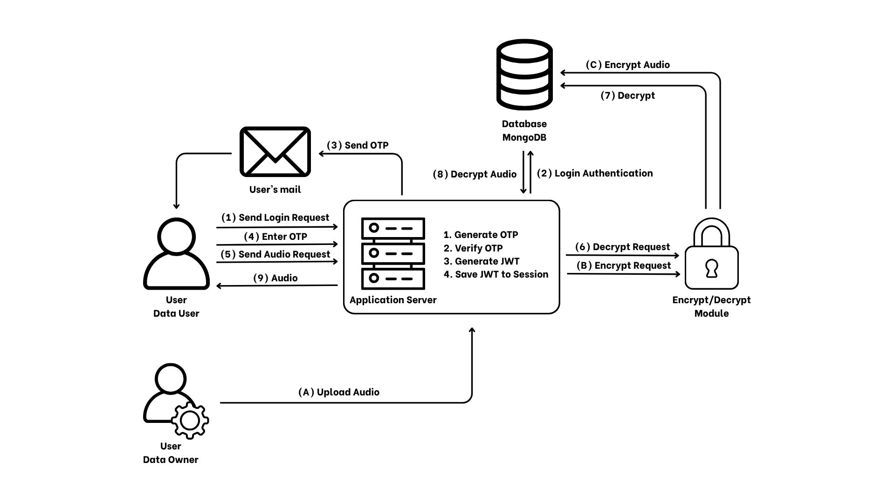

# Đồ án Chuyên ngành Mật mã: Ứng dụng Mã hóa Âm thanh An toàn

## Giới thiệu

Dự án này là một ứng dụng web Flask được thiết kế để trình diễn các kỹ thuật mã hóa âm thanh an toàn, bao gồm cả chuẩn công nghiệp AES-GCM và một phương pháp dựa trên luồng hỗn loạn (chaotic stream cipher). Ứng dụng cho phép người dùng đăng ký, đăng nhập (với xác thực hai yếu tố - 2FA qua email), tải lên tệp âm thanh WAV, mã hóa chúng bằng một trong hai thuật toán, và sau đó giải mã để lấy lại tệp gốc.

Mục tiêu chính của dự án là xây dựng một hệ thống hoàn chỉnh, an toàn, dễ bảo trì và có tài liệu tốt, tuân thủ các thực hành tốt nhất trong phát triển phần mềm và mật mã học ứng dụng.

## Kiến trúc



## Tính năng chính

*   **Xác thực người dùng:** Đăng ký, đăng nhập an toàn với mật khẩu được băm bằng Argon2.
*   **Xác thực hai yếu tố (2FA):** Tăng cường bảo mật đăng nhập bằng mã OTP gửi qua email.
*   **Quản lý Session và JWT:** Sử dụng session Flask và JSON Web Tokens (JWT) để quản lý trạng thái đăng nhập.
*   **Mã hóa AES-GCM:** Mã hóa/giải mã tệp âm thanh WAV bằng thuật toán AES-256-GCM, một chuẩn mã hóa xác thực mạnh mẽ.
*   **Mã hóa Chaotic Stream:** Mã hóa/giải mã tệp âm thanh WAV bằng mã hóa dòng dựa trên sơ đồ hỗn loạn (Logistic Map) kết hợp kiểm tra toàn vẹn bằng SHA-256.
*   **Lưu trữ Metadata:** Lưu trữ an toàn các thông tin cần thiết cho việc giải mã (như key, nonce, hash, thông số WAV) trong cơ sở dữ liệu MongoDB.
*   **Kiến trúc Module hóa:** Sử dụng Flask Blueprints để tổ chức mã nguồn rõ ràng, dễ mở rộng.
*   **Cấu hình linh hoạt:** Hỗ trợ các môi trường cấu hình khác nhau (development, testing, production).
*   **Kiểm thử toàn diện:** Bộ kiểm thử tự động (pytest) bao phủ các chức năng cốt lõi, bao gồm xác thực và mã hóa/giải mã.

## Công nghệ sử dụng

*   **Backend:** Python 3.11, Flask
*   **Mã hóa:**
    *   `cryptography` library (cho AES-GCM)
    *   `numpy` (cho tính toán trong chaotic stream)
    *   `hashlib` (cho SHA-256)
*   **Xác thực:** `argon2-cffi` (cho băm mật khẩu)
*   **Database:** MongoDB (thông qua `pymongo`)
*   **Session & Token:** Flask Session, `PyJWT`
*   **Email:** `smtplib` (cho gửi mã 2FA)
*   **Testing:** `pytest`

## Cài đặt và Chạy dự án

### Yêu cầu

*   Python 3.11+
*   Pip (trình quản lý gói Python)
*   MongoDB Server (đang chạy cục bộ hoặc trên cloud)
*   (Tùy chọn) Tài khoản email và SMTP server để gửi mã 2FA (ví dụ: Gmail với App Password)

### Các bước cài đặt

1.  **Clone repository:**
    ```bash
    git clone <URL_repository>
    cd <tên_thư_mục_repo>
    ```

2.  **Tạo và kích hoạt môi trường ảo (khuyến nghị):**
    ```bash
    python3.11 -m venv venv
    source venv/bin/activate  # Trên Linux/macOS
    # venv\Scripts\activate  # Trên Windows
    ```

3.  **Cài đặt các thư viện phụ thuộc:**
    ```bash
    pip install -r requirements.txt
    ```

4.  **Cấu hình môi trường:**
    *   Tạo một tệp `.env` trong thư mục gốc của dự án.
    *   Thêm các biến môi trường cần thiết vào tệp `.env`. Xem tệp `config.py` để biết các biến cần thiết, ví dụ quan trọng:
        ```dotenv
        FLASK_APP=run.py
        FLASK_CONFIG=development # Hoặc testing, production
        SECRET_KEY= khóa_bí_mật_cực_kỳ_an_toàn_và_ngẫu_nhiên # Thay bằng khóa bí mật thực sự
        MONGO_URI=mongodb://localhost:27017/MMH_DB_DEV # Thay bằng URI MongoDB của bạn

        # Cấu hình email cho 2FA (nếu muốn gửi mail thực tế)
        MAIL_SERVER=smtp.gmail.com
        MAIL_PORT=587
        MAIL_USE_TLS=true
        MAIL_USERNAME=địa_chỉ_email_của_bạn
        MAIL_PASSWORD=mật_khẩu_ứng_dụng_email # Hoặc mật khẩu email
        # MAIL_SUPPRESS_SEND=False # Đặt là True để không gửi mail khi dev/test
        ```
    *   **Quan trọng:** Đảm bảo `SECRET_KEY` là một chuỗi ngẫu nhiên, dài và được giữ bí mật.
    *   **Quan trọng:** Cập nhật `MONGO_URI` để trỏ đến instance MongoDB của bạn.

5.  **Chạy ứng dụng:**
    ```bash
    flask run
    ```
    Ứng dụng sẽ chạy trên `http://127.0.0.1:5000` (hoặc cổng khác nếu được cấu hình).

### Chạy kiểm thử

Đảm bảo bạn đã cài đặt các thư viện trong `requirements.txt` (bao gồm `pytest`). Chạy lệnh sau từ thư mục gốc của dự án:

```bash
python3.11 -m pytest -v
```

## Hướng dẫn sử dụng (API Endpoints chính)

Ứng dụng cung cấp các API endpoint sau (chi tiết sẽ có trong tài liệu API riêng):

*   **`/auth/signup` (POST):** Đăng ký người dùng mới.
*   **`/auth/login` (POST):** Đăng nhập (bắt đầu quy trình 2FA).
*   **`/auth/verify-2fa` (POST):** Xác thực mã OTP 2FA.
*   **`/auth/logout` (GET):** Đăng xuất.
*   **`/audio/upload` (POST):** Tải lên tệp âm thanh WAV (yêu cầu xác thực).
*   **`/audio/encrypt/<file_id>/<algorithm>` (POST):** Mã hóa tệp âm thanh đã tải lên bằng thuật toán chỉ định (`aes` hoặc `chaotic`) (yêu cầu xác thực).
*   **`/audio/decrypt/<file_id>` (POST):** Giải mã tệp âm thanh (yêu cầu xác thực).
*   **`/audio/download/<file_id>/<type>` (GET):** Tải xuống tệp gốc, mã hóa hoặc giải mã (yêu cầu xác thực).
*   **`/audio/files` (GET):** Liệt kê các tệp của người dùng (yêu cầu xác thực).

(Cần bổ sung chi tiết về request body, response format và yêu cầu header xác thực cho từng endpoint trong tài liệu API).

## Kiến trúc hệ thống

(Phần này sẽ mô tả chi tiết hơn trong tài liệu kiến trúc)

*   **Flask Application Factory:** Sử dụng `create_app` để khởi tạo ứng dụng, cho phép cấu hình linh hoạt.
*   **Blueprints:** Chia ứng dụng thành các module logic (ví dụ: `auth`, `audio`) để dễ quản lý.
*   **Models:** Lớp `User` trong `auth/models.py` xử lý logic nghiệp vụ liên quan đến người dùng và xác thực.
*   **Core Modules:** Các module trong `src/core` chứa logic cốt lõi không phụ thuộc vào Flask (ví dụ: `encryption`, `storage`).
*   **Configuration:** Tệp `config.py` quản lý các cấu hình cho các môi trường khác nhau.
*   **Database Interaction:** Sử dụng `pymongo` để tương tác trực tiếp với MongoDB.
*   **Testing:** Thư mục `tests` chứa các bài kiểm thử đơn vị và tích hợp sử dụng `pytest`.

## Đóng góp

Hiện tại, dự án này không mở cho đóng góp công khai. Tuy nhiên, nếu bạn có đề xuất hoặc phát hiện lỗi, vui lòng tạo Issue trong repository (nếu có).

## Giấy phép

(Cần xác định giấy phép cho dự án, ví dụ: MIT, Apache 2.0, hoặc ghi rõ "All rights reserved")

---

*(Tài liệu này sẽ được cập nhật và bổ sung chi tiết hơn)*

